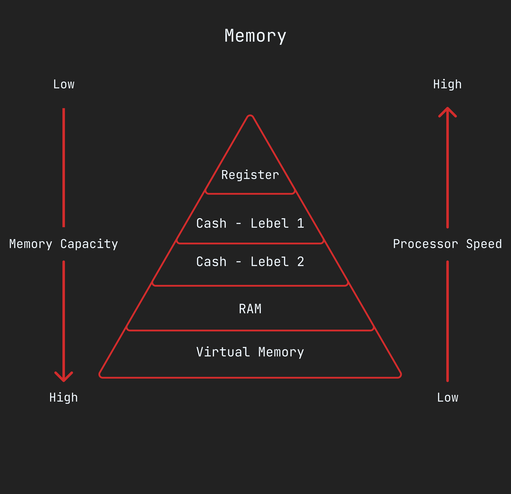

Chapter 1: Computer Memory
==========================


## Bit and Byte

**● Some important note :**
- 1 bit contain only one binary digit.
- 1 Byte = 8 bit.
- We can store number 0-3 in two bit.
- `unsigned` bit only store positive number.
- `signed` bit only store negative number.
- The number range for unsigned bit is `0 to 2^(number of bit) -1`.
- The number range for unsigned bit is `-2^(number of bit) to 2^(number of bit) -1`.
- `char` type of variable take only 1 bye.

**ASCII Value program :**
```c
#include <stdio.h>

int main(){
    int i ;
    
    for(i = 33;i <= 126;i++){
        printf("ASCII code for %c is %d\n",i,i);
    }

    return 0;
}

/*
Output :
ASCII code for ! is 33
ASCII code for " is 34
ASCII code for # is 35
ASCII code for $ is 36
ASCII code for % is 37
ASCII code for & is 38
......................
......................
*/
```

**Make letter to upper, Program :**
```c
#include <stdio.h>

int main(){
    char small_letter, capital_letter;

    printf("Please enter a small letter : ");
    small_letter = getchar();

    capital_letter = small_letter - 32;
    printf("This is capital letter is : %c\n",capital_letter);

    return 0;
}

/*
Please enter a small letter : d
This is capital letter is : D
*/
```

**Program to check is digit or not :**
```c
#include <stdio.h>

#define true 1
#define false 0
typedef short bool;

bool is_digit(char c){
    if(c >= '0' && c <= '9'){
        return true;
    }
    return false;
}

int main(){
    char c;

    printf("Please enter any character : ");
    
    c = getchar();
    getchar();

    if(is_digit(c)){
        printf("%c is a digit.\n",c);
    }else{
        printf("%c is not a digit.\n",c);
    }

    return 0;
}

/*
Output Sample 1 : 
Please enter any character : 5
5 is a digit.

Output Sample 2 : 
Please enter any character : s
s is not a digit.
*/
```

**Syntax to declare unsigned and signed variable :**
```c
/*
unsigned datatype variable_name;
signed datatype variable_name;
datatype variable_name; // this is signed variable by default
*/

// example 
unsigned int number;
signed int n; 
int n; // this is signed varibale by default
```

<hr />

## Address of variable

**● Some important note :**
- If variable `n` then the address is `&n`.
- Array name is address of first element of array.
- Use `%p` for print address.
- `sizeof` operator to see how many byte take variables.

**Program to printing address and value :**
```c
#include <stdio.h>

int main(){
    char ch1 = 'A', ch2 = 'B';
    int n1 = 100, n2 = 1000000;

    printf("Value of ch1 = %c,\t",ch1);
    printf("Address of ch1 = %p\n",&ch1);

    printf("Value of ch2 = %c,\t",ch2);
    printf("Address of ch2 = %p\n",&ch2);

    printf("Value of n1 = %d,\t",n1);
    printf("Address of n1 = %p\n",&n1);

    printf("Value of n2 = %d,\t",n2);
    printf("Address of n2 = %p\n",&n2);

    return 0;
}

/*
Output : 
Value of ch1 = A,       Address of ch1 = 0x7fff3b7f629f
Value of ch2 = B,       Address of ch2 = 0x7fff3b7f629e
Value of n1 = 100,      Address of n1 = 0x7fff3b7f6298
Value of n2 = 1000000,  Address of n2 = 0x7fff3b7f6294
*/
```

**Printing array address and their element address :**
```c
#include <stdio.h>

int main(){
    int ara[5] = {50,60,70,80,90};

    printf("Value of array : %d, %d, %d, %d, %d\n",ara[0],ara[1],ara[2],ara[3],ara[4]);
    printf("Address of ara is %p\n",&ara);
    printf("Addres of ara[0] is %p\n",&ara[0]);
    printf("Addres of ara[1] is %p\n",&ara[1]);
    printf("Addres of ara[2] is %p\n",&ara[2]);
    printf("Addres of ara[3] is %p\n",&ara[3]);
    printf("Addres of ara[4] is %p\n",&ara[4]);

    return 0;
}

/*
Output : 
Value of array : 50, 60, 70, 80, 90
Address of ara is 0x7ffcec1a7d60
Addres of ara[0] is 0x7ffcec1a7d60
Addres of ara[1] is 0x7ffcec1a7d64
Addres of ara[2] is 0x7ffcec1a7d68
Addres of ara[3] is 0x7ffcec1a7d6c
Addres of ara[4] is 0x7ffcec1a7d70
*/
```

**Using `sizeof` operator to see how many byte it take :**
```c
#include <stdio.h>

int main(){
    int num;
    char ch;
    double d_num;
    float f_num;

    printf("%lu\n",sizeof(int));
    printf("Size of int : %d\n",sizeof(num));
    printf("Size of char : %d\n",sizeof(char));
    printf("Size of double : %d\n",sizeof(double));
    printf("Size of float : %d\n",sizeof(float));

    return 0;
}

/*
Output : 
4
Size of int : 4
Size of char : 1
Size of double : 8
Size of float : 4
*/
```

<hr />

## Kind of Memory

**Some important note :**
- There are two kind of computer memory, Volatile(অস্থায়ী) and Non-Volatile(স্থায়ী)
- Use `register` keyword for store number in cpu register in c. Example : `register int number;`
  
Below is a diagram of computer memory : 



<hr />
<br />

#### [< Chapter 0: Before the Start](./../chapter_00/note.md) | [Part 2](./../part_2.md) | [Chapter 2: Pointer >](./../chapter_02/note.md)