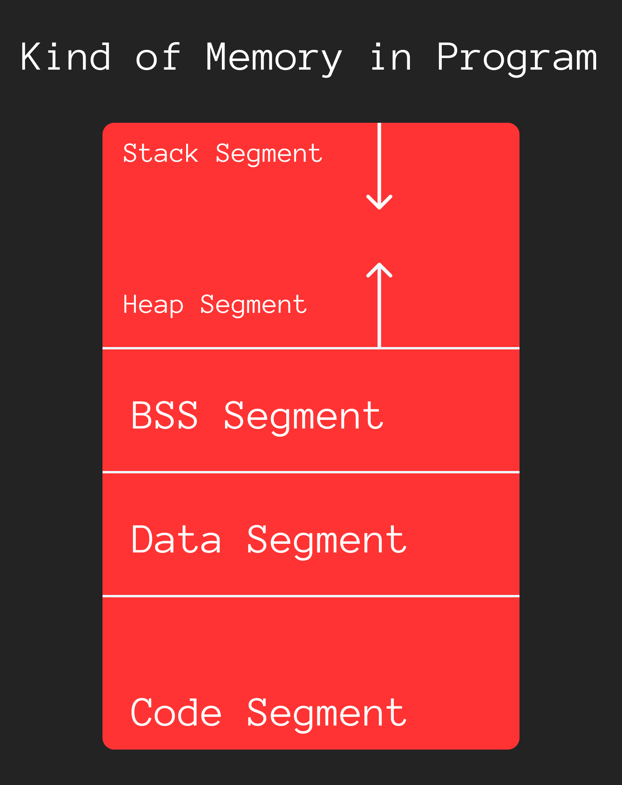

Chapter 4: Recursion
====================

**I divide this chapter into 4 part :**

● [Local Variable and Global Variable](#local-variable-and-global-variable) <br />
● [Static Variable](#static-variable) <br />
● [Kind of Memory](#kind-of-memory) <br />
● [Recursion](#recursion) <br />

---------------------------------------------------------------------------------------------------------------------------------------------

## Local Variable and Global Variable
> 🟢 A variable which is declare outside of any function even main function called global variable. All global variable by default value are 0 except pointer.

> 🟢 A variable which is declare in function body called local variable of those function. Initially those type of variable are initialize with junk value or garbage value.

> 🟢 Global variable are accessible in any function or other file function where it include.

**Example of global and local variable :**
```c
#include <stdio.h>

// global value
int x; // initial 0 by default

int main(){
    int y;

    printf("x = %d, y = %d\n",x,y);
    return 0;
}

/*
x = 0, y = 0

here local variable y = 0 dose not mean it is y default vairable,
it can be anything, next time it maybe initialize with 0 or initialize with non-zero value.
*/
```

**Program of example to changing global vairable value from function :**
```c
#include <stdio.h>

int x = 1;

void myfnc(int y){
    y = y *2;
    x = x + 10; // this x is global function x
    printf("myfnc, x = %d, y = %d\n",x,y);
}

int main(){
    int y = 5;
    x = 10;
    myfnc(5);

    printf("main, x = %d, y = %d\n",x,y);
    return 0;
}

/*
Output : 
myfnc, x = 20, y = 10
main, x = 20, y = 5
*/
```

-------------------------------------------------------------------------------------------------------------------------------------------

## Static Variable

**There are two type of static variable in c :**
- [Global Scope Static Variable](#global-scope-static-variable)
- [Function Scope static Variable](#function-scope-static-variable)

> 🔵 All static variable declare with `static` keyword.

#### Global Scope Static Variable
> 🔴 `global scope static` variable only access only functions which file it declared.

*Program example of global static variable :*
```c
#include <stdio.h>

int a;
static int b;

void func(){
    a = a + 1;
    b = b + 1;
}

int main(){
    func();
    printf("a = %d\n",a);
    printf("b = %d\n",b);
    return 0;
}

/*
Output : 
myfnc, x = 20, y = 10
main, x = 20, y = 5

*/
```

#### Function Scope Static Variable

> A static variable which is declare inside the function called **function scope static variable.**
> 🟢 A function variable declare one time. If it declared then when function is work out, it can not be erased. When the function call again then it use old value.

**Program to example of function static variable :**
```c
#include <stdio.h>

void func(){
    int a = 10;
    static int s = 10;
    a = a + 2;
    s = s + 2;

    printf("a = %d, s = %d\n",a,s);
}

int main(){
    func();
    func();
    func();

    return 0;
}

/*
Output :
a = 12, s = 12
a = 12, s = 14
a = 12, s = 16
*/
```
---------------------------------------------------------------------------------------------------------------------------------------------

## Kind of Memory

Operating system divide the memory into some part. Here is daigram of all memory part : 



- **Code Segment :** Here store pices of code which is excution so many time.
- **Data Segment :** Here store initilized data which is declare in global with assign a value. Also stroe constant.
- **BSS Segment :** This is the part of data segment. Here store the uninitialized global and static variable.
- **Stack Segment :** Local vairable and argument of store here.
- **Heap Segment :** If locate the memory with pointer then program use this **heap segment**


---------------------------------------------------------------------------------------------------------------------------------------------

## Recursion

> 🟢 A function which can call itself called recursion function.

Every recursion function has a three part : 
- *Base Condition :* where function stop calling it self and return something.
- *Statements :* Stements which execute in every call.
- *Calling :* Call itself.

**Here simple recursion without base condition :**
```c
#include <stdio.h>

void recurse(){
    char *s = "Hurrey, I am learning recursion!";
    printf("%s\n",s);
    recurse(); // call itself.
}

int main(){
    recurse();

    return 0;
}
```

**Here recursion call with base condition :**
```c
#include <stdio.h>

void recurse(int count){
    if(count > 5){
        // here recursion will stop
        return ;
    }

    printf("Count = %d\n",count);
    recurse(count+1);
}

int main(){
    recurse(1);
    return 0;
}

/*
Output : 
Count = 1
Count = 2
Count = 3
Count = 4
Count = 5
*/
```

**Here recursion to using `static` variable :**
```c
#include <stdio.h>

void recurse(){
    static int count = 1;

    if(count > 5){
        return ;
    }

    printf("Count = %d\n",count);
    count++;
    recurse();
}

int main(){
    recurse();
    return 0;
}

/*
Output : 
Count = 1
Count = 2
Count = 3
Count = 4
Count = 5
*/
```

**Here recursion way to figure out the factorial :**
```c
#include <stdio.h>

int f_calls = 0;

int factorial(int n){
    f_calls++;

    if(n == 0){
        return 1;
    }

    return n*factorial(n-1);
}

int main(){
    int n;

    scanf("%d",&n);

    if(n < 0){
        printf("Undefined\n");
        return 0;
    }

    printf("Factorial of %d is %d\n",n,factorial(n));

    printf("Number of function calls : %d\n",f_calls);

    return 0;
}

/*
Output : 
5
Factorial of 5 is 120
Number of function calls : 6
*/
```

**Here recursion to find the fibonacci number :**
```c
#include <stdio.h>
#include <string.h>

int f_calls = 0;

int fib(int n){
    f_calls = f_calls + 1;

    if(n == 1 || n == 2){
        return 1;
    }

    return fib(n-1) + fib(n-2);
}

int main(){
    int n;
    char s[3];

    scanf("%d",&n);

    if(n == 1){
        strcpy(s,"st");
    }else if(n == 2){
        strcpy(s,"nd");
    }else if(n == 3){
        strcpy(s,"rd");
    }else{
        strcpy(s,"th");
    }

    printf("%d%s fibonacci number is %d\n",n,s,fib(n));
    printf("Number of function calls : %d\n",f_calls);
    return 0;
}

/*
Output : 
7
7th fibonacci number is 13
Number of function calls : 25
*/
```

**Another fibonacci term figure out program using recursion but dynamic approach :**
```c
#include <stdio.h>

int f_calls = 0;
int fibo[50];

int fib(int n){
    f_calls = f_calls + 1;
    
    if(fibo[n] != 0){
        return fibo[n];
    }

    if(n == 1 || n < 2){
        return fibo[n];
    }

    fibo[n] = fib(n-1) + fib(n-2);
    return fibo[n];
}

int main(){
    int n;
    char s[3];

    fibo[1] = 1;
    fibo[2] = 1;


    scanf("%d",&n);

    if(n==1){
        strcpy(s,"st");
    }else if(n == 2){
        strcpy(s,"th");
    }else if(n==3){
        strcpy(s,"rd");
    }else{
        strcpy(s,"th");
    }

    printf("%d%s fibonacci number is %d\n",n,s,fib(n));
    printf("Number of function calls : %d\n",f_calls);

    for(n = 1;n < 12;n++){
        printf("%d : %d\n",n,fibo[n]);
    }
    
    return 0;
}

/*
10
10th fibonacci number is 55
Number of function calls : 17
1 : 1
2 : 1
3 : 2
4 : 3
5 : 5
6 : 8
7 : 13
8 : 21
9 : 34
10 : 55
11 : 0
*/
```

<hr />
<br />

#### [< Chapter 3: File](./../chapter_03/note.md) | [Part 2](./../part_2.md) | [Chapter 5: Bitwise Operator >](./../chapter_05/note.md)