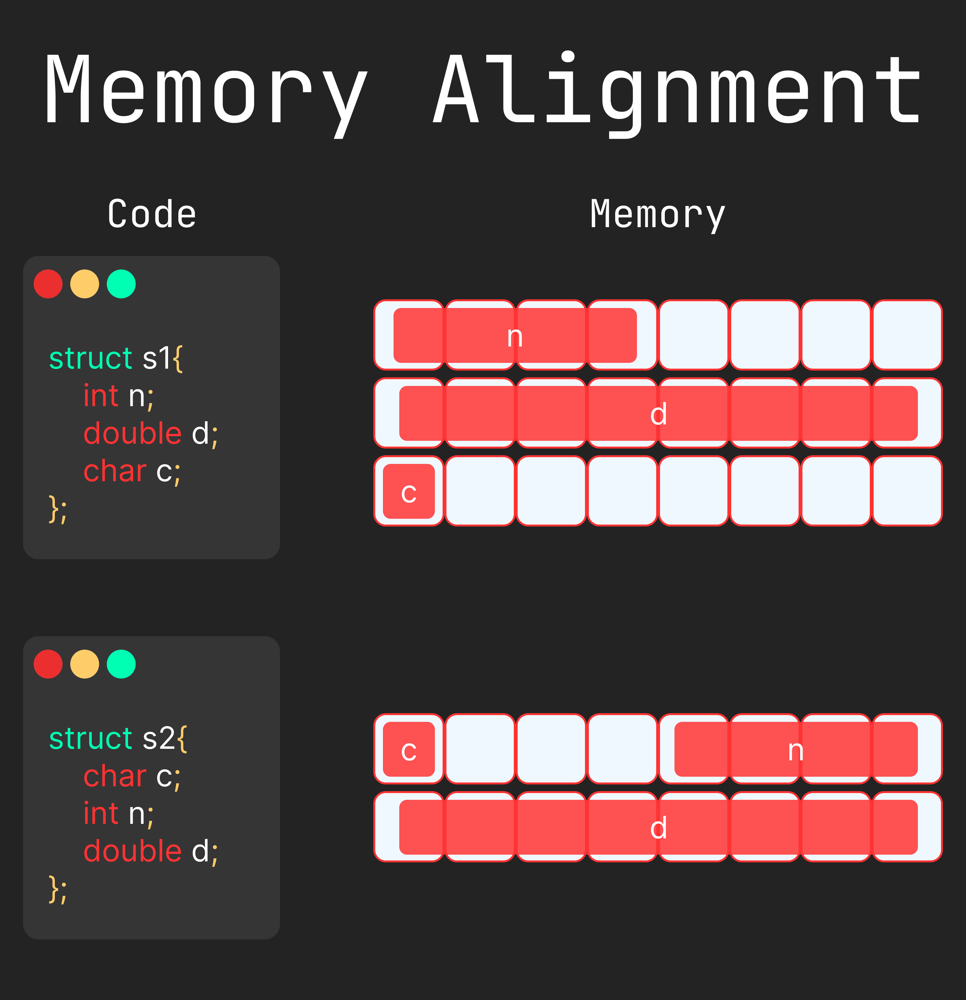

Chapter 6: Structure and Union
==============================

Here is the topics which is contain this chapter :

- [Structure](#structure)
- [typedef](#typedef)
- [Union](#union)
- [Memory Alignment](#memory-alignment)

--------------------------------------------------------------------------------------------------------------------------------------------

## Structure
Here is the syntax to declare and create structure type variable : 
```c
// define the struct
struct struct_name{
    data_type struct_member_name;
    data_type struct_member_name;
    ...................
}

// declare the structure variable
struct struct_name struct_vairable_name;

// access struct memeber using dot operator
struct_variable_name.member_name;

// it is possible nested struct
struct struct_name{
    data_type member_name;
    struct anothe_struct_name struct_variable_name;
}

// access member from struct ponter member
struct_poiner_name -> member_name;
```

>> 🔴 When pass the structure variable as a argument then function got the copy of structure variable.


**Example of Simple Structure :**
```c
#include <stdio.h>
#include <string.h>

int main(){
    struct student{
        int id;
        char name[40];
    };

    struct student one;

    one.id = 1;
    strcpy(one.name,"Anonymo");

    printf("Id : %d\n",one.id);
    printf("Name : %s\n",one.name);

    return 0;
}

/*
Output : 
Id : 1
Name : Anonymo

*/
```

**Example of use structure member for take a user input :**
```c
#include <stdio.h>

struct student {
    int id;
    char name[40];
};

int main(){
    struct student one;

    scanf("%d",&one.id);
    scanf(" %[^\n]",one.name); // get input untill find the '\n' char

    printf("> Name : %s\n",one.name);
    printf("> Id : %d\n",one.id);
    return 0;
}

/*
Ouput : 
324
ANS Anonymo
> Name : ANS Anonymo
> Id : 324

*/
```

**Another example of nested structure :**
```c
#include <stdio.h>
#include <string.h>

struct nametype{
    char first[20];
    char last[20];
};

struct student{
    int id;
    struct nametype name;
};

int main(){
    struct student me;

    scanf("%d",&me.id);
    getchar();

    scanf("%s",me.name.first);
    getchar();

    scanf("%s",me.name.last);
    getchar();

    printf("> Id : %d\n",me.id);
    printf("> Name : %s %s\n",me.name.first,me.name.last); 
    return 0;
}

/*
3345
Arabi
Arrowbeen
> Id : 3345
> Name : Arabi Arrowbeen

*/
```

**Another example of structure array :**
```c
#include <stdio.h>
#include <string.h>

struct nametype {
    char first[20];
    char last[20];
};

struct studenttype {
    int id;
    struct nametype name;
};

int main(){
    struct studenttype students[5];

    int i,n = 5;

    for(i = 0;i < n;i++){
        printf("Enter the student details for student %d: \n",i+1);
        printf("> ID : ");
        scanf("%d",&students[i].id);
        getchar();

        printf("> First Name : ");
        scanf("%s",students[i].name.first);
        getchar();

        printf("> Last name : ");
        scanf("%s",students[i].name.last);

        printf("\n");
    }

    printf("\n-----> Output <-----\n");
    for(i = 0;i < n;i++){
        printf("> Hello, %s %s (%d)\n",students[i].name.first,students[i].name.last,students[i].id);
    }
}
```

--------------------------------------------------------------------------------------------------------------------------------

## typedef
`typedef` is a keyword to use a alias named for others thing. Here is syntex :

```c
tyedef syntax alias_name;
```

**Here is example of using typedef to short the structure name :**
```c
#include <stdio.h>
#include <string.h>

typedef struct{
    char first[20];
    char last[20];
} nametype;

typedef struct{
    int id;
    nametype name;
    char grade[5];
} studenttype;

void calculate_grade(studenttype * s,int mark){
    if(mark >= 80){
        strcpy(s->grade,"A+");
    }else if(mark >= 70){
        strcpy(s->grade,"A");
    }else if(mark >= 60){
        strcpy(s->grade,"A-");
    }else if(mark >= 50){
        strcpy(s->grade,"B");
    }else if(mark >= 40){
        strcpy(s->grade,"C");
    }else{
        strcpy(s->grade,"F");
    }
}

int main(){
    studenttype students[3];

    int i,n = 3;

    int marks[] = {72,82,60};

    printf(">>> Enter the students details <<<\n");
    for(i = 0;i < n;i++){
        printf("> ID : ");
        scanf("%d",&students[i].id);
        getchar();

        printf("> First Name : ");
        scanf("%s",students[i].name.first);
        getchar();

        printf("> Last Name : ");
        scanf("%s",students[i].name.last);
        getchar();
        printf("\n");
    }

    for(i = 0;i < n;i++){
        calculate_grade(&students[i],marks[i]);
    }

    printf("\n>>> Output <<<\n");
    for(i = 0;i < n;i++){
        printf("> Hey, %s %s(%d) Your got in exam %s.\n",students[i].name.first,students[i].name.last,students[i].id,students[i].grade);
    }
    return 0;
}
```

--------------------------------------------------------------------------------------------------------------------------------

## Union
`union` is fully like structure but difference is that it take the space is size of it's longest member size. Here is the syntax to declare union :
```c
union union_name{
    datatype member_name;
}

// everything look like structure.
// but when use the member then only one member is able to use.
```

**Here is example of `union` size :**
```c
#include <stdio.h>

struct s {
    char ch;
    int n;
    char str[16];
} sv;

union u{
    char ch;
    int n;
    char str[16];
} uv;

int main(){
    int struct_size,union_size;

    struct_size = sizeof(sv);
    union_size = sizeof(uv);

    printf("Structure variable took %d bytes\n",struct_size);
    printf("Union variable took %d byte\n",union_size);

    return 0;
}

/*
Output : 
Structure variable took 24 bytes
Union variable took 16 byte
*/
```

**Useage of union :**
```c
#include <stdio.h>

union u{
    char ch;
    int x;
    int y;
} uv;

int main(){
    uv.ch = 'A';
    printf("uv.ch = %c\n",uv.ch);

    uv.x = 17;
    printf("uv.x = %d\n",uv.x);
    printf("uv.ch = %c\n",uv.ch);

    uv.y = 18;
    printf("uv.y = %d\n",uv.y);
    printf("uv.ch = %c\n",uv.ch);
    printf("uv.x = %d\n",uv.x);
    return 0;
}
```

--------------------------------------------------------------------------------------------------------------------------------

## Memory Alignment
C compiler take the memory in order. Here is the order of same type of structure take different type of size :

```c
#include <stdio.h>

struct s1{
    int n;
    double d;
    char c;
};

struct s2 {
    char c;
    int n;
    double d;
};

int main(){
    printf("char size : %lu bytes\n",sizeof(char));
    printf("int size : %lu bytes\n",sizeof(int));
    printf("double size : %lu bytes\n",sizeof(double));

    printf("\ns1 size : %lu bytes\n",sizeof(struct s1));
    printf("s2 size : %lu bytes\n",sizeof(struct s2));
    return 0;
}

/*
Output :
char size : 1 bytes
int size : 4 bytes
double size : 8 bytes

s1 size : 24 bytes
s2 size : 16 bytes
*/
```

Below diagram simple diagram to understand how to take `s1` and `s2` take a memory from memory :



<hr />
<br />

#### [< Chapter 5: Bitwise Operator](./../chapter_05/note.md) | [Part 2](./../part_2.md) | [Chapter 7: More Pointer >](./../chapter_07/note.md)