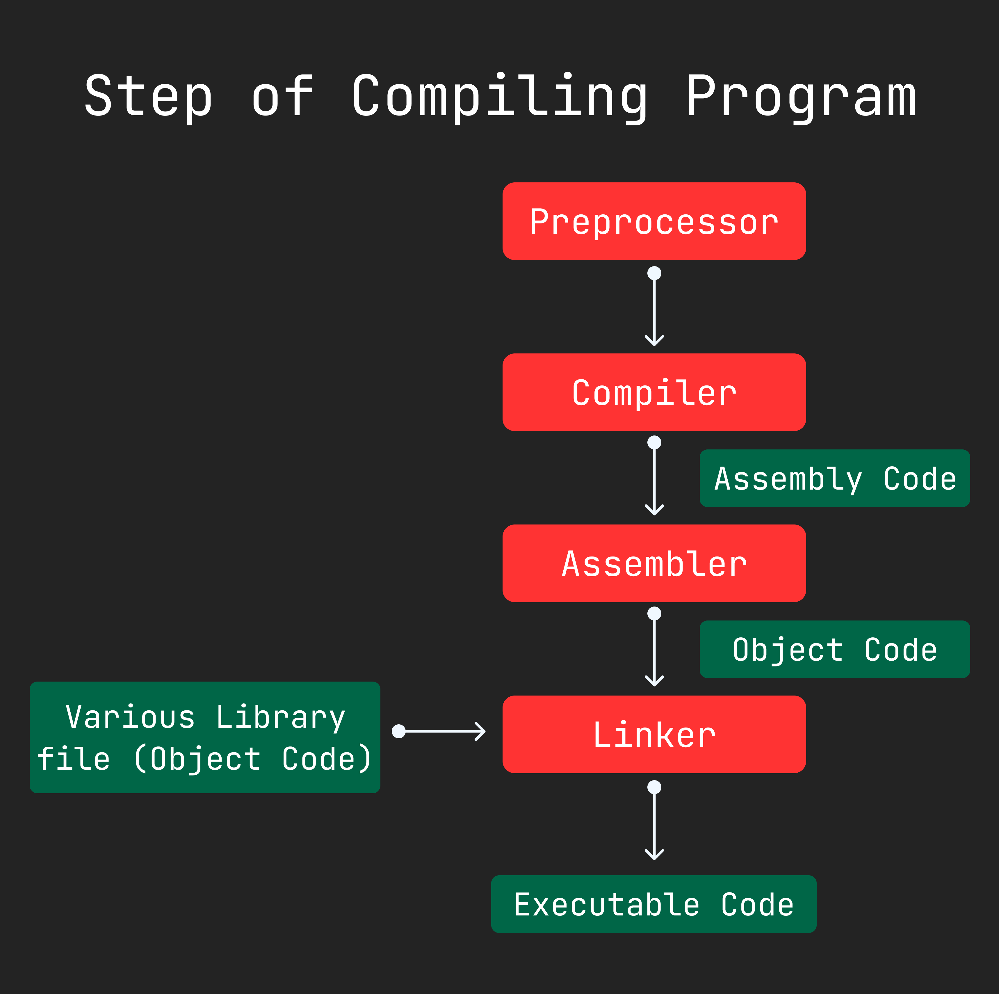

Chapter 9: Misc
===============

**This chapter contain :**
- *[Constant and Macro](#constant-and-macro)*
- *[Enum](#enum)*
- *[Switch](#switch)*
- *[Command Line Argument](#command-line-argument)*
- *[All Step to Compiling the Program](#all-step-to-compiling-the-program)*
- *[Main Function Return Value](#main-function-return-value)*

<hr />
<br />

## Constant and Macro

#### Constant
*Syntax of define constant :*
```c
#define CONSTANT_NAME VALUE
```

*Here is constant example :*
```c
#include <stdio.h>
#include <math.h>

#define MIN -1
#define PI (2*acos(0))

int main(){
    printf("Value of MIN : %d\n",MIN);
    printf("Value of PI : %lf\n",PI);
    
    /*
    Here Min replace by this "-1"
    Here PI replace by this "(2*acos(0))"
    */

    return 0;
}

/*
Value of MIN : -1
Value of PI : 3.141593
*/
```

*Another example :*
```c
#include <stdio.h>

#define p 50
#define q 60;

int main(){
    int a = p; // p replace with "50"
    int b = q // q replace with "60;"

    printf("a = %d, b = %d\n",a,b);


    return 0;
}

/*
Output : 
a = 50, b = 60
*/
```

#### Macro
**Here is a example of macro :**
```c
#include <stdio.h>

#define MAX(a,b) (a > b ? a : b)

int main(){
    int a = 83, b = 323;
    double d1 = 8.32323, d2 = 3.33332323;

    printf("maximum of %d and %d  is %d\n",a,b,MAX(a,b));
    printf("maximum of %lf and %lf is %lf\n",d1,d2,MAX(d1,d2));
    return 0;
}

/*
Output : 
maximum of 83 and 323  is 323
maximum of 8.323230 and 3.333323 is 8.323230
*/

/*
Here macro is 
#define MAX(a,b) (a > b ? a : b)

when write MAX(2,3) then it will be replace below code block
(2 > 3 ? 2 : 3)

*/
```

**Multiline macro :**
```c
#include <stdio.h>

#define MAX(a,b) (a > b ? a : b)

int main(){
    int a = 83, b = 323;
    double d1 = 8.32323, d2 = 3.33332323;

    printf("maximum of %d and %d  is %d\n",a,b,MAX(a,b));
    printf("maximum of %lf and %lf is %lf\n",d1,d2,MAX(d1,d2));
    return 0;
}

/*
Output : 
maximum of 83 and 323  is 323
maximum of 8.323230 and 3.333323 is 8.323230
*/

/*
Here macro is 
#define MAX(a,b) (a > b ? a : b)

when write MAX(2,3) then it will be replace below code block
(2 > 3 ? 2 : 3)

*/
```

#### When use macro and define
- When use function to easy for solving problem but it take a time then use macro.
- Define the all constant value with `#define` and use upper letter for naming constant.
-----------------------------------------------------------------------------------------------------------------------------------


## Enum
**Syntax of enum :**
```c
enum enum_name{value,value_one,value_two};

// enum with custom value
enum enum_name{value=1,value_one=2,value_two=2};
```

Example of enum : 
```c
#include <stdio.h>

//           0,  1,    2
enum COLOR {RED,GREEN,BLUE};

int main(){

    enum COLOR selected_color;
    int num;

    printf("Enter 1 for RED, 2 for GREEN, 3 for BLUE : ");
    scanf("%d",&num);

    if(num == 1){
        selected_color = RED;
    }else if(num == 2){
        selected_color = GREEN;
    }else if(num == 3){
        selected_color = BLUE;
    }

    printf("selected_color : %d\n",selected_color);
    return 0;
}

/*
Output : 
Enter 1 for RED, 2 for GREEN, 3 for BLUE : 2
selected_color : 1
*/
```

**Another example :**
```c
#include <stdio.h>

enum COLOR {
    NO_COLOR,
    RED,
    GREEN,
    BLUE
};

int main(){
    printf("value NO_COLOR : %d\n",NO_COLOR);
    printf("value RED : %d\n",RED);
    printf("value GREEN : %d\n",GREEN);
    printf("value BLUE : %d\n",BLUE);
}

/*
Output : 
value NO_COLOR : 0
value RED : 1
value GREEN : 2
value BLUE : 3
*/
```

***Customize enum value :**
```c
#include <stdio.h>

enum COLOR {
    NO_COLOR,
    RED,
    GREEN,
    BLUE
};

int main(){
    printf("value NO_COLOR : %d\n",NO_COLOR);
    printf("value RED : %d\n",RED);
    printf("value GREEN : %d\n",GREEN);
    printf("value BLUE : %d\n",BLUE);
}

/*
Output : 
value NO_COLOR : 0
value RED : 1
value GREEN : 2
value BLUE : 3
*/
```

-----------------------------------------------------------------------------------------------------------------------------------

## Switch
Syntax of `switch` :
```c
switch(value){
    case expression :
        // code block
        break;
    case expression :
        // code block
        break;
    .................
    .................
    .................
    default :
        // code block
        break;
}
```


**Example of switch :**
```c
#include <stdio.h>

enum DAY {SUNDAY,MONDAY,TUESDAY,WEDNESDAY,THURSDAY,FRIDAY,SATURDAY};

int main(){
    enum DAY today;
    today = THURSDAY;

    switch(today){
        case SUNDAY:
            printf("Today is Sunday. It is a work day\n");
            break;
        case MONDAY:
            printf("Today is Monday. It is a work day\n");
            break;
        case TUESDAY:
            printf("Today is Tuesday. It is a work day\n");
            break;
        case WEDNESDAY:
            printf("Today is Wednesday. It is a work day\n");
            break;
        case THURSDAY:
            printf("Today is Thursday. It is a work day\n");
            break;
        case FRIDAY:
            printf("Today is Friday. It is a holiday.\n");
            break;
        case SATURDAY:
            printf("Today is Saturday. It is a holiday.\n");
            break;
    }
    return 0;
}

/*
Output : 
Today is Thursday. It is a work day
*/
```
-----------------------------------------------------------------------------------------------------------------------------------

## Command Line Argument
Main function take two argument. One is number of element of vector. Second is vector. Here is syntax : 
```c
int main(int argc,char *argv[]);

// here 
/*
argc : size of argv
argv : all parameter when it called
argv[0] : is file name.

*/
```
**Example :**
```c
#include <stdio.h>
#include <stdlib.h>

int main(int argc,char *argv[]){
    int n1,n2,sum;

    n1 = atoi(argv[1]); // convert string to a integer.
    n2 = atoi(argv[2]);  // convert string to a integer.

    sum = n1 + n2;
    printf("%d + %d = %d\n",n1,n2,sum);
    return 0;
}

/*
run > ./exe/07.command_line_args.bin 4 5

Output :
> 4 + 5 = 9
*/
```

**Another example :**
```c
#include <stdio.h>

int main(int argc,char *argv[]){
    if(argc != 2){
        printf("Please enter one argument (your name) \n");
        return 1;
    }

    printf("Welcome %s\n",argv[1]);
    return 0;
}

/*
run :
> ./exe/08.command_line.bin

output :
Please enter one argument (your name)

run : 
> ./exe/08.command_line.bin Anonymo

output : 
Welcome Anonymo
*/
```

**Another Example :**
```c
#include <stdio.h>

int main(int argc,char *argv[]){
    printf("Argument count : %d\n",argc);
    printf("First argument : %s\n",argv[0]);
    return 0;
}

/*
Output :
Argument count : 1
First argument : ./exe/09.command_line.bin
*/
```

-----------------------------------------------------------------------------------------------------------------------------------


## All Step to Compiling the Program




-----------------------------------------------------------------------------------------------------------------------------------

## Main Function Return Value

**Standard Way to Define the Main Method :**
```c
int main(void);
int main(int argc,int *argv);
int main(int argc,int **argv);
```

**Return Value :**
```c
0; // if success to terminate the program
EXIT_SUCCESS; // it is include in stdlib header file
EXIT_FAILURE; // it is include in stdlib header file
```

> 🔴 Dose not define return type as `void` in C++ language. 


-----------------------------------------------------------------------------------------------------------------------------------

#### [< Chapter 8: Some more fun program](./../chapter_08/note.md) | [Part 2](./../part_2.md) | [Chapter 10: Program debugging >](./../chapter_10/note.md)